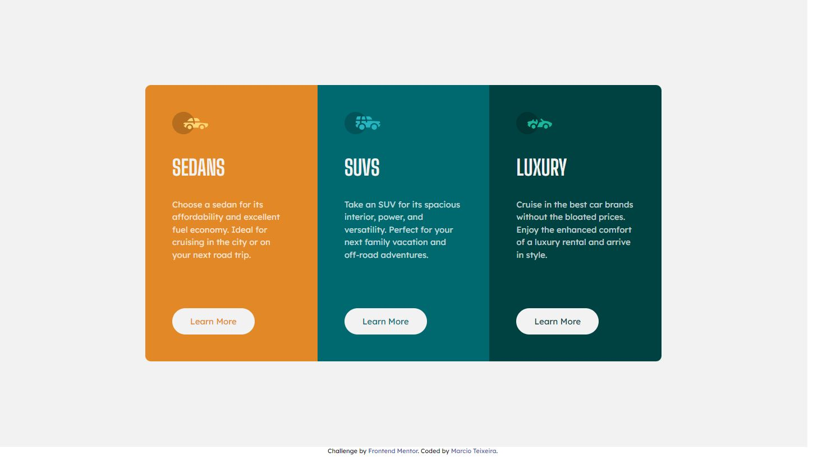
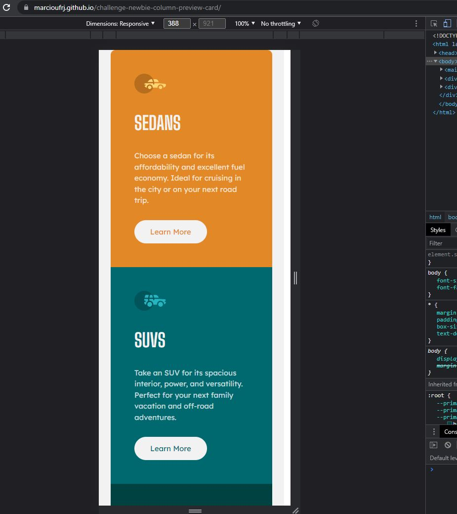

# Frontend Mentor - 3-column preview card component solution

This is a solution to the [3-column preview card component challenge on Frontend Mentor](https://www.frontendmentor.io/challenges/3column-preview-card-component-pH92eAR2-). Frontend Mentor challenges help you improve your coding skills by building realistic projects. 

## Table of contents

- [Overview](#overview)
  - [The challenge](#the-challenge)
  - [Screenshot](#screenshot)
  - [Links](#links)
- [My process](#my-process)
  - [Built with](#built-with)
  - [What I learned](#what-i-learned)
  - [Continued development](#continued-development)
  - [Useful resources](#useful-resources)
- [Author](#author)

## Overview

### The challenge

Users should be able to:

- View the optimal layout depending on their device's screen size
- See hover states for interactive elements

### Screenshot

### Links

- Solution URL: [URL here](https://www.frontendmentor.io/solutions/3-column-preview-card-component-using-css-grid-9DhDTSI55)
- Live Site URL: [URL here](https://marcioufrj.github.io/challenge-newbie-column-preview-card/)

## My process

### Built with

- Semantic HTML5 markup
- CSS custom properties
- Flexbox
- CSS Grid

### What I learned

### Continued development

 - Learn more about CSS Grid
 - Develop my organizational skill to use "div" and classes more efficiently

### Useful resources

- [CSS Tricks - GRID](https://css-tricks.com/snippets/css/complete-guide-grid/) - This helped me for displaying the cards.

## Author

- Frontend Mentor - [@marcioUfrj](https://www.frontendmentor.io/profile/marcioUfrj)